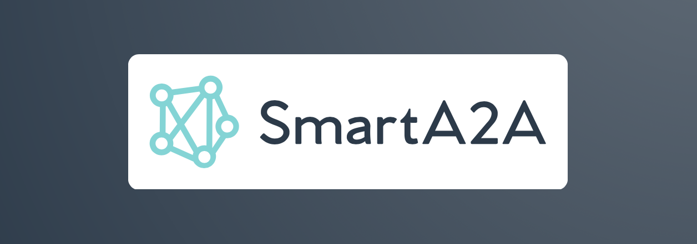

<picture>
  
</picture>

<div>
<br>
</div>


**SmartA2A** is a Python framework that helps you build servers and AI agents that communicate using the [A2A (Agent2Agent) protocol](https://developers.googleblog.com/en/a2a-a-new-era-of-agent-interoperability/). A2A defines a common language that enables agents to exchange information and collaborate effectively across systems.

SmartA2A abstracts the complexities of the protocol, so you can focus on what matters—your agent's logic and behavior. It supports two primary use cases:

### ✅ 1. Build A2A-Compliant Servers

Use SmartA2A to expose key A2A methods through a simple decorator-based API. This allows you to:

- Build compliant server endpoints quickly
- Integrate your own agent logic using any framework (e.g., LangGraph, Google ADK, or custom code)
- Stay fully aligned with the A2A spec without boilerplate

### 🤖 2. Create Full-Fledged Agents with Minimal Code

SmartA2A can also be used to create standalone agents that:

- Speak the A2A protocol out of the box
- Collaborate with other agents seamlessly
- Connect to any MCP server you choose
- Require only a few lines of setup

SmartA2A makes it easy to build interoperable, communication-ready AI systems—whether you're extending existing frameworks or starting from scratch.

---

## Installation

```bash
pip install -U smarta2a
```

## Examples

There are 3 cool examples for you to try out - eacher cooler than the next! 

1. The first is a simple Echo server implementation that demonstrates the FastAPI'esk style in which you can create an A2A compliant server. If you're using another Agent framework like LangGraph you can easily use it in tandem with this server.  

2. This is where things start to get real interesting - you can easily create an LLM and MCP powered Agent in just a few lines of code. In this case a US weather agent.

3. If you get here, this is where things things start to get really awesome. You will create a multi-agent system where a delegator agent delelgates tasks to the weather agent you created before and to an Airbnb agent. You can now plan your stay based on the weather!

Note that you can find all the examples in the examples folder.

### Simple Echo Server Implementation

Here's a simple example of an echo server that demonstrates the core features of SmartA2A:

```python
from smarta2a.server import SmartA2A
from smarta2a.utils.types import A2AResponse, TaskStatus, TaskState, TextPart, FileContent, FilePart
from smarta2a.state_stores.inmemory_state_store import InMemoryStateStore

# Initialize the server with an in-memory state store
state_store = InMemoryStateStore()
app = SmartA2A("EchoServer", state_store=state_store)

@app.on_send_task()
async def handle_task(request, state):
    """Echo the input text back as a completed task. If you were using something like LangGraph you could call your graph.invoke method here """
    input_text = request.content[0].text
    return f"Response to task: {input_text}"

@app.on_send_subscribe_task()
async def handle_subscribe_task(request, state):
    """Subscribe to the task and stream multiple responses"""
    input_text = request.content[0].text
    yield f"First response to the task: {input_text}"
    yield f"Second response to the task: {input_text}"
    yield f"Third response to the task: {input_text}"

@app.task_get()
def handle_get_task(request):
    """Get the task status"""
    return f"Task: {request.id}"

@app.task_cancel()
def handle_cancel_task(request):
    """Cancel the task"""
    return f"Task cancelled: {request.id}"
```

This example shows:
- Setting up a basic A2A server with state management
- Handling synchronous task requests with text responses (btw also handles files!)
- Implementing streaming responses for subscription tasks
- Basic task management (get and cancel operations)

To run the echo server:
```bash
uvicorn path.to.echo_server.main.py:app
```

You can test the echo server using curl commands:

```bash
# Test sending a task
curl -X POST http://localhost:8000/ \
  -H "Content-Type: application/json" \
  -d '{
    "jsonrpc": "2.0",
    "id": "1",
    "method": "tasks/send",
    "params": {
      "id": "task1",
      "message": {
        "role": "user",
        "parts": [{"type": "text", "text": "Hello, echo server!"}]
      }
    }
  }'

# Test subscribing to a task
curl -X POST http://localhost:8000/ \
  -H "Content-Type: application/json" \
  -d '{
    "jsonrpc": "2.0",
    "id": "2",
    "method": "tasks/sendSubscribe",
    "params": {
      "id": "task2",
      "message": {
        "role": "user",
        "parts": [{"type": "text", "text": "Hello, streaming echo!"}]
      }
    }
  }'
```

### Weather Agent Example

Here's an example of a weather agent that uses OpenAI's GPT model to handle weather-related queries. Note that you will need to setup the weather MCP server as a pre-requisite as specified by the [MCP Quick-start server tutorial](https://modelcontextprotocol.io/quickstart/server). You will also need to add your OpenAI API key to the .env file.

```python
from dotenv import load_dotenv
import os
import uvicorn
from smarta2a.agent.a2a_agent import A2AAgent
from smarta2a.model_providers.openai_provider import OpenAIProvider

# Load environment variables from the .env file
load_dotenv()

# Initialize OpenAI provider with weather-specific configuration
openai_provider = OpenAIProvider(
    api_key=os.getenv("OPENAI_API_KEY"),
    model="gpt-4o-mini",
    base_system_prompt="You are a cheerful assistant that specialises in helping with weather related queries",
    mcp_server_urls_or_paths=["/path/to/weather.py"],  # Path to your weather service
)

# Create and run the agent
agent = A2AAgent(
    name="openai_agent",
    model_provider=openai_provider,
)

if __name__ == "__main__":
    uvicorn.run(agent.get_app(), host="0.0.0.0", port=8000)
```

This example demonstrates:
- Setting up an AI agent with OpenAI integration
- Configuring a specialized system prompt for weather queries
- Connecting to external weather services via MCP
- Running the agent as a standalone server

To run the weather agent:
```bash
python path/to/weather_agent/main.py
```

To test the weather agent, ensure:
1. Your weather MCP server is running
2. Your OpenAI API key is set in the .env file
3. The agent is running as shown above

Then test it with curl:

```bash
# Test weather query
curl -X POST http://localhost:8000/ \
  -H "Content-Type: application/json" \
  -d '{
    "jsonrpc": "2.0",
    "id": "1",
    "method": "tasks/send",
    "params": {
      "id": "weather1",
      "message": {
        "role": "user",
        "parts": [{"type": "text", "text": "What is the weather in New York?"}]
      }
    }
  }'
```

### Multi-agent Weather-Aware Stay Planner

This example demonstrates how to create a multi-agent system where a delegator agent coordinates between a weather agent and an Airbnb agent to help plan stays based on weather conditions. You'll need to run three agents:

1. The weather agent (from the previous example)
2. An Airbnb agent that connects to the Airbnb MCP server
3. A delegator agent that coordinates between them

First, let's create the Airbnb agent:

```python
from dotenv import load_dotenv
import os
import uvicorn
from smarta2a.agent.a2a_agent import A2AAgent
from smarta2a.model_providers.openai_provider import OpenAIProvider

# Load environment variables
load_dotenv()

# Initialize OpenAI provider with Airbnb-specific configuration
openai_provider = OpenAIProvider(
    api_key=os.getenv("OPENAI_API_KEY"),
    model="gpt-4o-mini",
    base_system_prompt="You are a cheerful assistant that specialises in helping with Airbnb related queries",
    mcp_server_urls_or_paths=["@openbnb/mcp-server-airbnb --ignore-robots-txt"]
)

# Create and run the Airbnb agent
agent = A2AAgent(
    name="airbnb_agent",
    model_provider=openai_provider,
)

if __name__ == "__main__":
    uvicorn.run(agent.get_app(), host="0.0.0.0", port=8002)
```

Now, let's create the delegator agent that coordinates between the weather and Airbnb agents:

```python
from dotenv import load_dotenv
import os
import uvicorn
from smarta2a.agent.a2a_agent import A2AAgent
from smarta2a.model_providers.openai_provider import OpenAIProvider
from smarta2a.utils.types import AgentCard, AgentCapabilities, AgentSkill

# Load environment variables
load_dotenv()

# Define the weather agent's capabilities
weather_agent_card = AgentCard(
    name="weather_agent",
    description="A weather agent that can help with weather related queries",
    version="0.1.0",
    url="http://localhost:8000",
    capabilities=AgentCapabilities(),
    skills=[
        AgentSkill(
            id="weather_forecasting",
            name="Weather Forecasting",
            description="Can get weather forecast for a given location"
        ),
        AgentSkill(
            id="weather_alerts",
            name="Weather Alerts",
            description="Can get weather alerts for a US state"
        )
    ]
)

# Define the Airbnb agent's capabilities
airbnb_agent_card = AgentCard(
    name="airbnb_agent",
    description="An Airbnb agent that can help with accommodation queries",
    version="0.1.0",
    url="http://localhost:8002",
    capabilities=AgentCapabilities(),
    skills=[
        AgentSkill(
            id="search_listings",
            name="Search Listings",
            description="Search for Airbnb listings by location, dates, and guests"
        ),
        AgentSkill(
            id="get_listing_details",
            name="Get Listing Details",
            description="Get detailed information about specific Airbnb listings"
        )
    ]
)

# Initialize OpenAI provider with both agent cards
openai_provider = OpenAIProvider(
    api_key=os.getenv("OPENAI_API_KEY"),
    model="gpt-4o-mini",
    agent_cards=[weather_agent_card, airbnb_agent_card]
)

# Create and run the delegator agent
agent = A2AAgent(
    name="delegator_agent",
    model_provider=openai_provider,
)

if __name__ == "__main__":
    uvicorn.run(agent.get_app(), host="0.0.0.0", port=8001)
```

To run the multi-agent system:

1. Start the weather agent:
```bash
python path/to/weather_agent/main.py
```

2. Start the weather agent:
```bash
python path/to/airbnb_agent/main.py
```


3. Start the delegator agent:
```bash
python path/to/delegator_agent/main.py
```

You can then test the system with a curl command:

```bash
# Test multi-agent planning
curl -X POST http://localhost:8001/ \
  -H "Content-Type: application/json" \
  -d '{
    "jsonrpc": "2.0",
    "id": "1",
    "method": "tasks/send",
    "params": {
      "id": "plan1",
      "message": {
        "role": "user",
        "parts": [{"type": "text", "text": "I want to go someplace sunny in California. Just me and my wife. Can you check the weather forecast in the major cities and give me some airbnb recommendations that are appropriate. I want to stay from the 7th of May and checking out on the 10th of May. I'm not fussed about the budget."}]
      }
    }
  }'
```

This example demonstrates:
- Creating specialized agents for different domains (weather and Airbnb)
- Defining agent capabilities and skills using AgentCard
- Setting up a delegator agent that can coordinate between multiple agents
- Running multiple agents on different ports
- Making complex queries that require coordination between agents

---

## Roadmap

There's still a lot more to come ...

- Documentation site with tutorials, explanation of concepts, blog and a contribution guide
- Support for more LLM providers
- Support for more memory types
- Authorization and observability framework built-in
- Many more !

## License

This project is licensed under the MIT License - see the [LICENSE](LICENSE) file for details. 